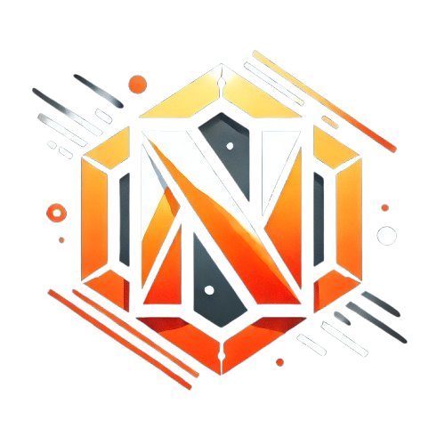

<spacer></spacer>

    

<a href="https://novux.at">Novux</a>

## Introduction

Novux is an open-source project aiming to create everything needed for a minecraft network containing:
- A Website
- Microservices
- Minecraft plugins

> **Disclaimer:** This project is only for teaching purposes. **Novux won't be a "real" minecraft network**

## License
This project is licensed under the [MIT License](https://de.wikipedia.org/wiki/MIT-Lizenz) - see the [LICENSE](LICENSE) file for details